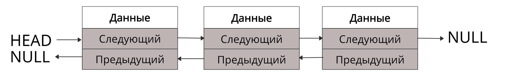

# Linked list

Связный список — это группа из узлов. В каждом узле содержатся:
- Данные.
- Указатель или ссылка на следующий узел.
- В некоторых списках — ещё и ссылка на предыдущий узел.

В итоге получается список, у которого есть чёткая последовательность элементов. При этом сами элементы более разрозненны, чем в массиве, поскольку хранятся отдельно. Быстро перемещаться между элементами списка помогают указатели.

