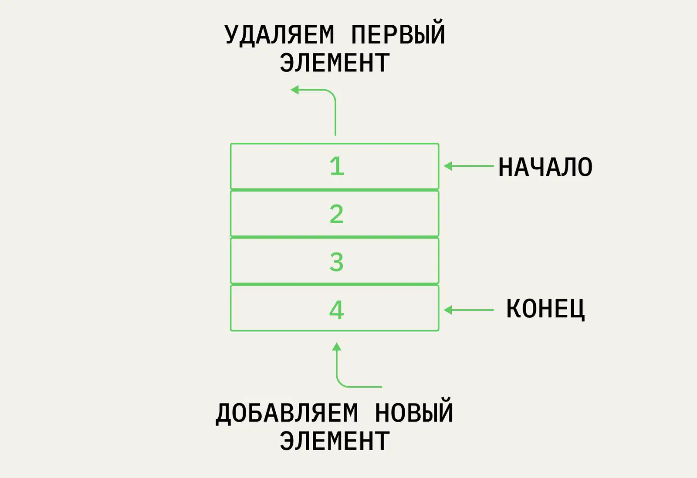

# Queue

Этот вид структуры представляет собой ряд данных, как и стек. Но в отличие от него она работает по принципу FIFO — First In, First Out (англ. «первым пришёл — первым ушёл»). Данные добавляют в конец, а извлекают из начала

