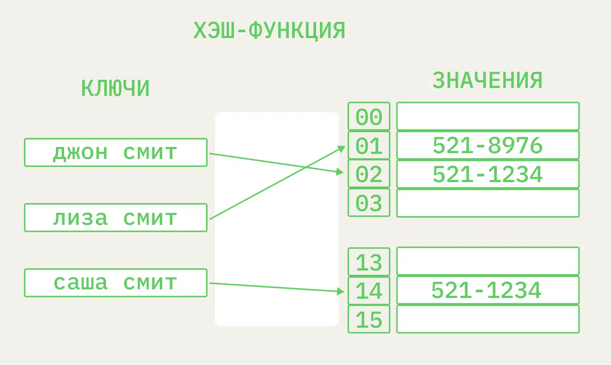

# Hash map (hash table)

Частный случай map. В ней есть ключи и значения, а для их реализации добавляются индексы. Специальная хэш-функция позволяет по ключу вычислить индекс, чтобы найти нужные данные.

