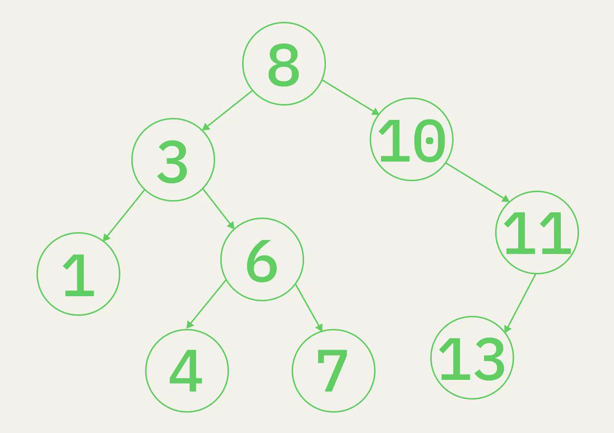

# Binary search tree

Иерархическая структура данных

- У каждого узла не больше двух дочерних.
- Если новое значение меньше, оно становится левым дочерним либо дочерним левого дочернего.
- Если значение больше, оно становится правым дочерним или дочерним правого дочернего.

### Как применяют двоичные деревья:

- Для быстрого поиска данных.
- Для хранения данных в отсортированном виде с возможностью быстро их добавлять и удалять.

## Links

- https://codechick.io/tutorials/dsa/dsa-binary-search-tree
