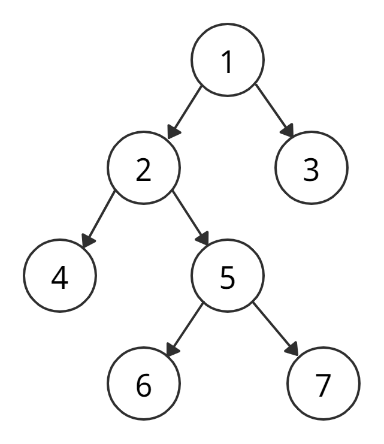
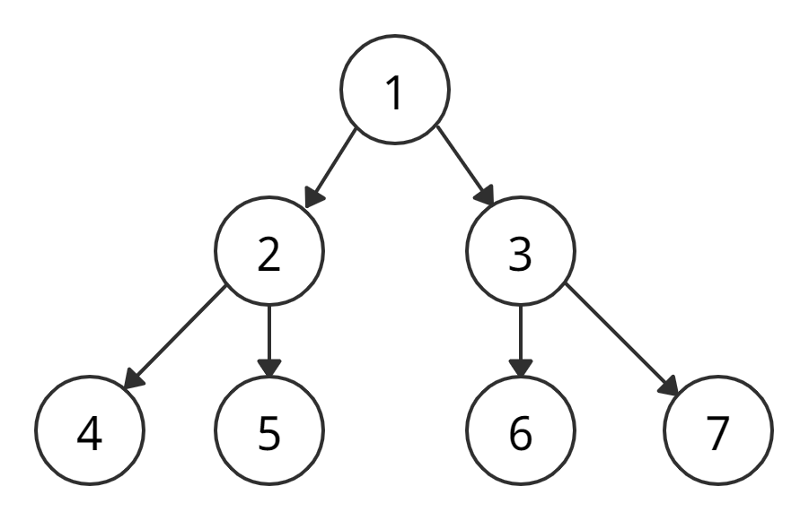
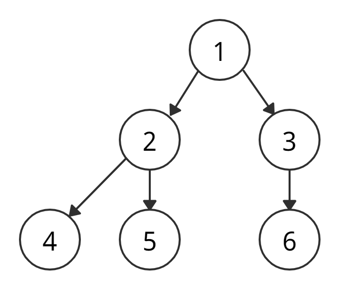
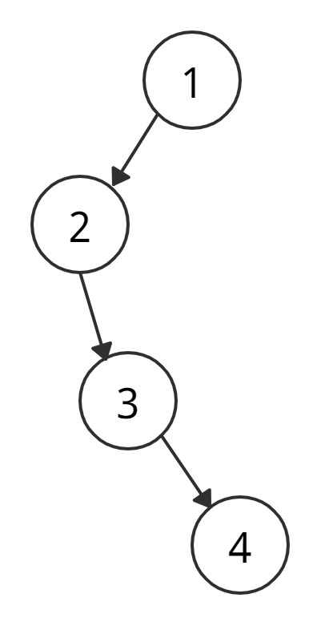
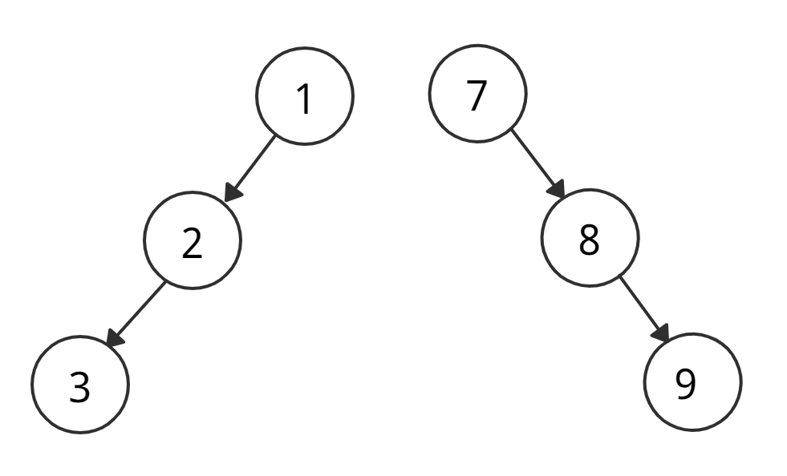
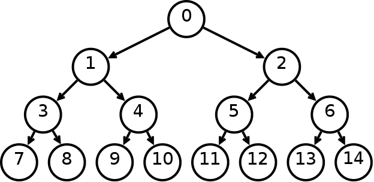

# Binary tree

Двоичное дерево — древовидная структура данных, в которой у родительских узлов не может быть больше двух детей.

## Типы двоичных деревьев

### Полное двоичное дерево

Особый тип бинарных деревьев, в котором у каждого узла либо 0 потомков, либо 2.

### Совершенное двоичное дерево

Особый тип бинарного дерева, в котором у каждого внутреннего узла по два ребенка, а листовые вершины находятся на одном уровне.

### Законченное двоичное дерево

Законченное двоичное дерево похоже на совершенное, но есть три большие отличия.

- Все уровни должны быть заполнены.
- Все листовые вершины склоняются влево.
- У последней листовой вершины может не быть правого собрата. Это значит, что завершенное дерево необязательно полное.

### Вырожденное двоичное дерево

Дерево, в котором на каждый уровень приходится по одной вершине.

### Скошенное вырожденное дерево

Вырожденное дерево, в котором есть либо только левые, либо только правые узлы. Таким образом, есть два типа скошенных деревьев — скошенные влево вырожденные деревья и скошенные вправо вырожденные деревья.

### Сбалансированное двоичное дерево

Тип бинарного дерева, в котором у каждой вершины количество вершин в левом и правом поддереве различаются либо на 0, либо на 1.

## Links

- https://codechick.io/tutorials/dsa/dsa-binary-tree
