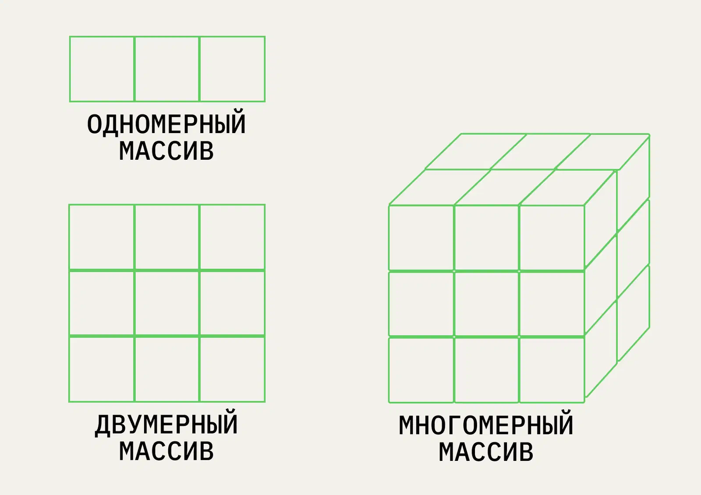

# Array

Массив — это таблица. Каждый его элемент имеет индекс — «адрес», по которому этот элемент можно извлечь. Данные в
массиве можно просматривать, сортировать и изменять

Преимущества:
- Быстрый доступ к элементам по индексу
- Непрерывная область памяти

Недостатки:
- Фиксированный размер
- Неэффективное добавление/удаление элементов

### Одномерные

У каждого элемента только один индекс. Можно представить это как строку с данными, где одного номера достаточно, чтобы
чётко определить положение каждой переменной.

### Многомерные

У каждого элемента два или больше индексов. По сути, это комбинация из нескольких одномерных массивов, то есть вложенная
структура.

