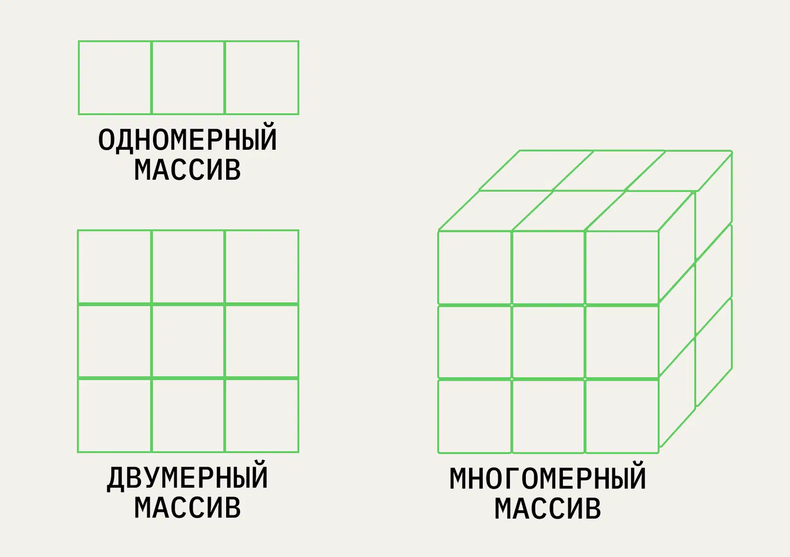

Array (Массив)

Таблица элементов; у каждого есть индекс — «адрес», по которому элемент извлекается. Данные можно просматривать,
сортировать и изменять.

## Плюсы и минусы

- Плюсы: быстрый доступ по индексу O(1), непрерывная область памяти.
- Минусы: фиксированный размер, дорогие вставка/удаление в середину (сдвиг элементов).

## Виды

- **Одномерные** — один индекс на элемент.
- **Многомерные** — два и более индексов; по сути вложенные одномерные массивы.

