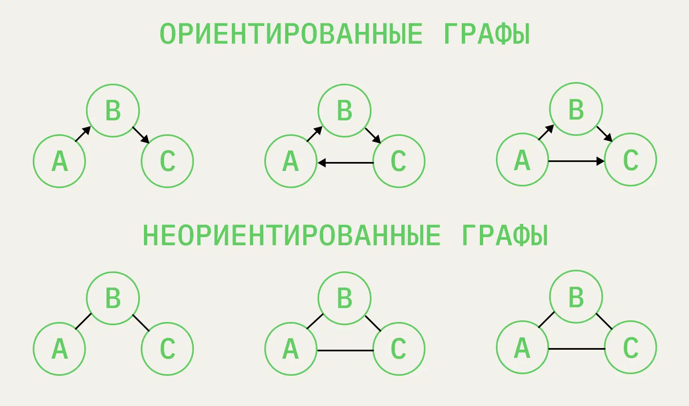

# Graph

Граф — это более общий случай дерева. Иногда деревья называют ациклическими графами.

Отличий у этих структур данных два:

- В графе возможны циклы, то есть «ребёнок» может быть «родителем» для того же элемента.
- Рёбра тоже могут нести смысловую нагрузку, то есть нужно сохранять их значения.

Графы бывают ориентированные и неориентированные. У первых рёбра между узлами имеют направление, так что порядок
элементов важен. У вторых направлений нет, и элементы можно читать и обходить в любом порядке.

## Как применяют графы

- Для хранения информации, связанной друг с другом сложными соотношениями.
- Для анализа соотносящейся друг с другом информации.
- Для построения маршрута из точки А в точку Б.

