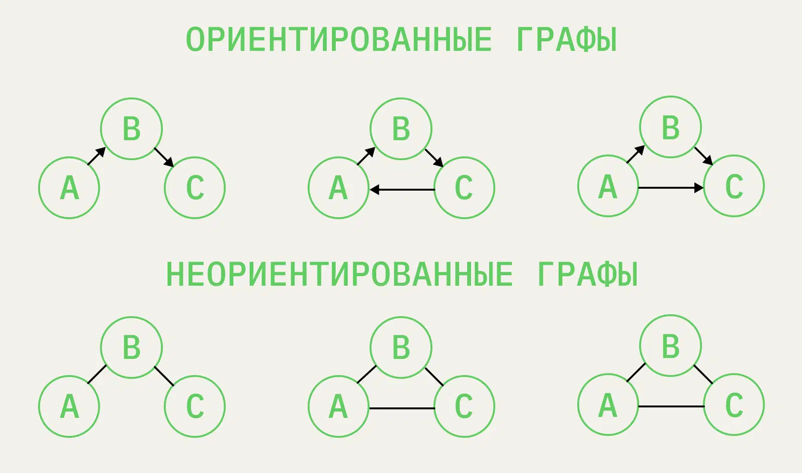

Graph (Граф)

Более общий случай дерева (дерево — ациклический граф). Узлы соединены рёбрами, которые сами могут нести смысл.

## Отличия от дерева

- Возможны циклы: «ребёнок» может быть «родителем» того же элемента.
- Рёбра могут хранить значения (вес, тип связи).

## Виды

- **Ориентированные** — рёбра имеют направление, порядок важен.
- **Неориентированные** — направлений нет, обход в любую сторону.

## Как применяют

- Хранение и анализ сложно связанных данных, построение маршрутов из A в B.
