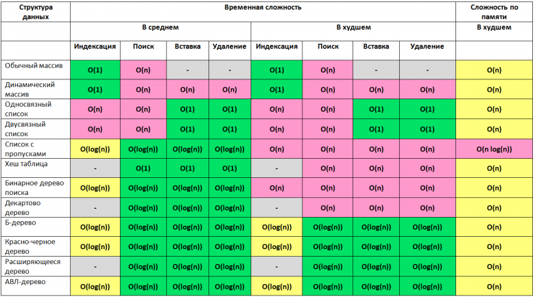

# Data Structures

Структура данных — способ организации информации для более эффективного использования.

## Абстрактные типы данных (АТД)

АТД — математическая модель, задающая набор данных и операции над ними, но не их реализацию. То есть описывает, *что*
можно делать с данными, а не *как* это сделано.

- [Stack](stacks/index.md)
- [Queue](queue/index.md)
- [List](lists/index.md)
- [Set](sets/index.md)
- [Map](map/index.md)

### Linear

- [Array](arrays/index.md)
- [List](lists/index.md)
- [Stack](stacks/index.md)
- [Queue](queue/index.md)

### Non-linear

- [Tree](trees/index.md)
- [Graph](graphs/index.md)

## Сравнение

## Links

- https://practicum.yandex.ru/blog/10-osnovnyh-struktur-dannyh/
- https://www.geeksforgeeks.org/dsa/difference-between-binary-tree-and-binary-search-tree/
- https://habr.com/ru/articles/188010/
