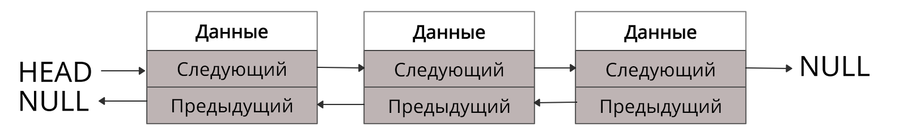
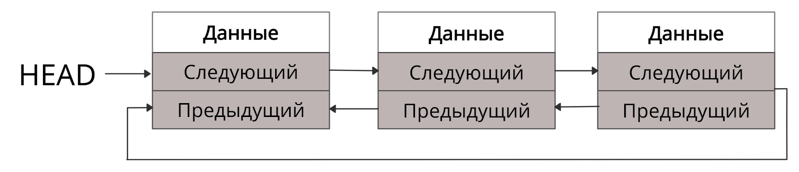

Linked List (Связный список)

Группа узлов; каждый хранит данные и указатель(и) на соседей. Вставка/удаление при известном узле — O(1), доступ по
индексу — O(n).

## Типы

### Односвязный

В каждом узле указатель на следующий.

### Двусвязный

Добавляется указатель на предыдущий узел — можно двигаться в обе стороны (двунаправленный).

### Кольцевой

Последний элемент связан с первым; бывает одно- и двусвязным.

- Односвязный: указатель next последнего узла указывает на первый узел.
- Двусвязный: указатель prev первого узла указывает на последний узел.

## Links

https://codechick.io/tutorials/dsa/dsa-linked-list-types
