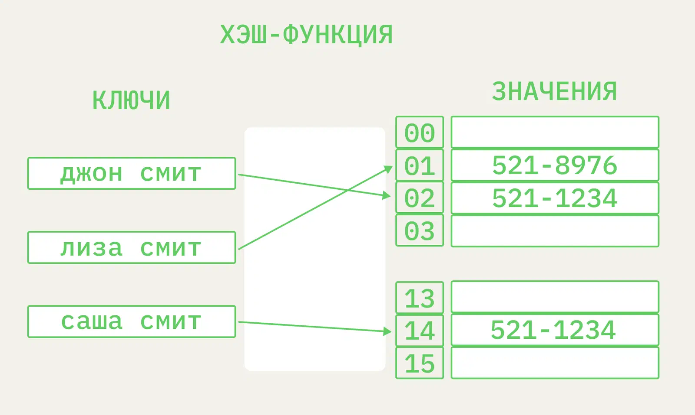

Hash Map (Hash Table)

Частный случай map: хэш-функция по ключу вычисляет индекс в массиве, где лежит значение.

## Свойства

- Доступ/вставка/удаление — O(1) в среднем, O(n) в худшем (много коллизий).

## Темы

- **hash-functions** — как считать индекс.
- **collision-resolution** — что делать при коллизиях (chaining, open-addressing).
- **analysis** — load factor и сложность.
