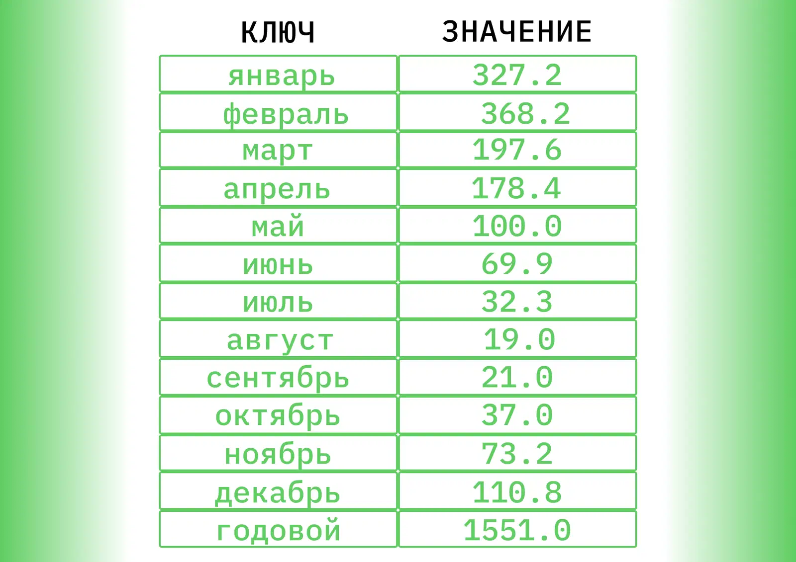

# Map (Ассоциативный массив, словарь)

Данные хранятся парами «ключ/значение»: каждый ключ уникален, значения могут повторяться — одному ключу соответствует
одно значение.

## Реализации

- Hash table — O(1) в среднем; сбалансированное дерево — O(log n), но ключи упорядочены (см. [hash-tables](hash-tables/index.md)).
