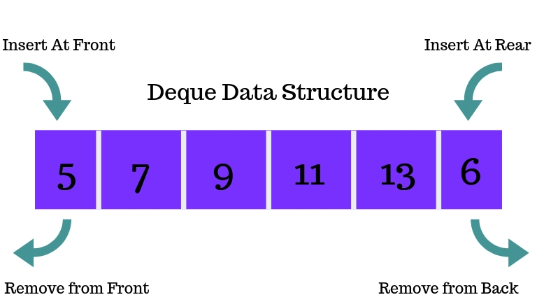

# Deque (Двусторонняя очередь)

Абстрактный тип данных, в котором элементы можно добавлять и удалять как в начало, так и в конец.

## Реализация

- Через двусвязный список или динамический массив; обобщает stack и queue.

