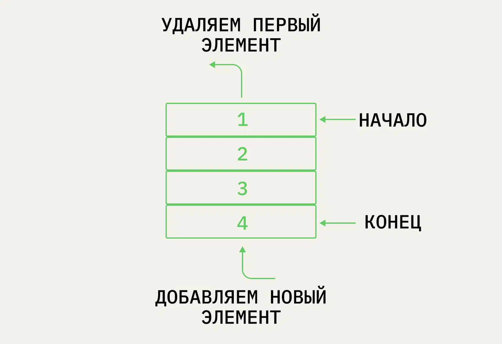

Queue (Очередь)

Данные добавляются в конец, извлекаются из начала — принцип FIFO (First In, First Out): первым пришёл, первым ушёл.

## Свойства

- enqueue / dequeue — O(1).
- Применение: буферы, планировщики, обход в ширину (BFS).

