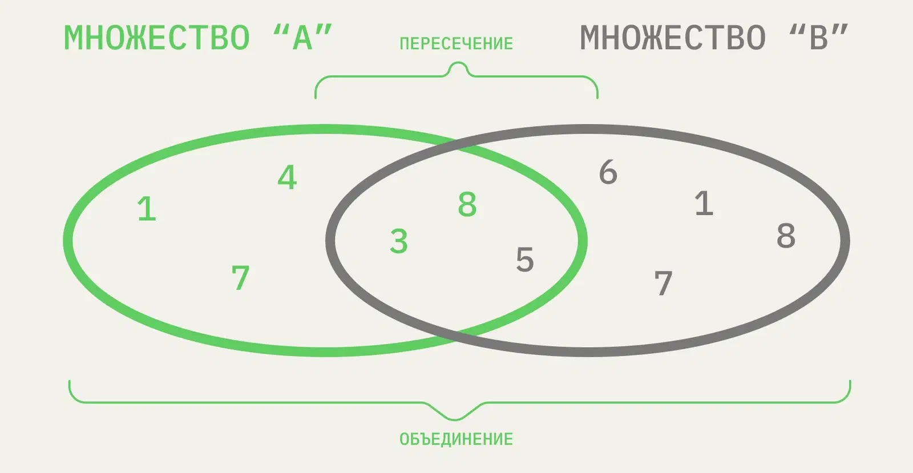

# Sets

В отличие от предыдущих базовых структур, во множестве данные не упорядочены. Они хранятся группой, их нельзя структурировать и в некоторых случаях нельзя сортировать. Зато с ними можно работать как с классическими математическими множествами: объединять, искать пересечения, вычислять разность и смотреть, является ли одно множество подмножеством другого.

