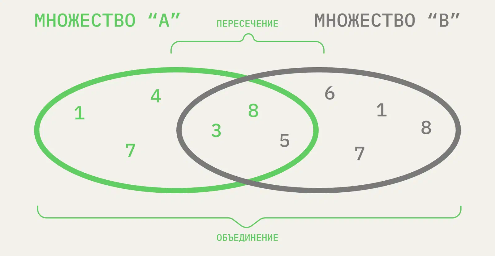

Set (Множество)

Неупорядоченная коллекция уникальных элементов. Поддерживает математические операции: объединение, пересечение,
разность, проверку подмножества.

## Реализации

- HashSet — O(1) в среднем; TreeSet — упорядочен, O(log n); BitSet — компактен для плотных integer-множеств (см. set-operations.md).
