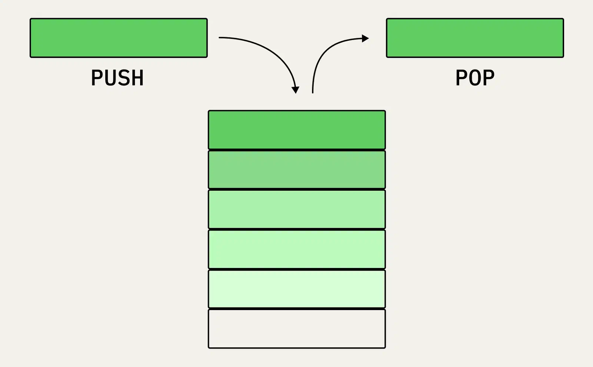

Stack (Стек)

Добавление и удаление только с одного конца — принцип LIFO (Last In, First Out): последний пришёл, первым ушёл.

## Свойства

- push / pop / peek — O(1).
- Применение: call stack вызовов функций, undo, обход в глубину (DFS).

