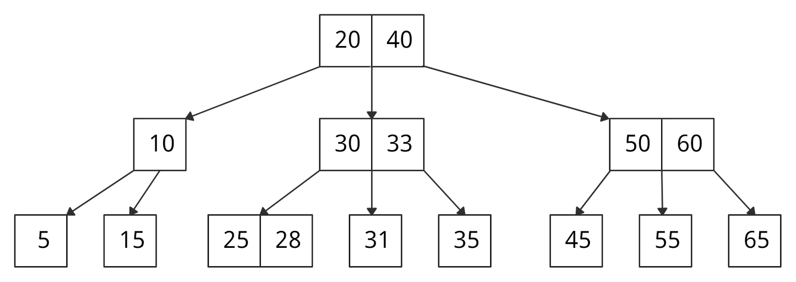

# B-tree

Особый тип сбалансированного дерева поиска, в котором каждый узел может содержать более одного ключа и иметь более двух
дочерних элементов. Из-за этого свойства B-дерево называют сильноветвящимся.

### Зачем нужно

Вторичные запоминающие устройства (жесткие диски, SSD) медленно работают с большим объемом данных. Людям захотелось
сократить время доступа к физическим носителям информации, поэтому возникла потребность в таких структурах данных,
которые способны это сделать.

Двоичное дерево поиска, АВЛ-дерево, красно-черное дерево и т. д. могут хранить только один ключ в одном узле. Если нужно
хранить больше, высота деревьев резко начинает расти, из-за этого время доступа сильно увеличивается.

С B-деревом все не так. Оно позволяет хранить много ключей в одном узле и при этом может ссылаться на несколько дочерних
узлов. Это значительно уменьшает высоту дерева и, соответственно, обеспечивает более быстрый доступ к диску.

# Links

- https://codechick.io/tutorials/dsa/dsa-b-tree
