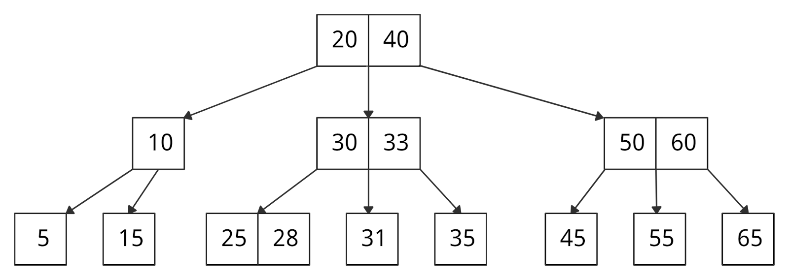

B-tree

Сбалансированное дерево поиска, где узел может содержать много ключей и иметь много детей (сильноветвящееся).

## Зачем нужно

- Диски/SSD медленно работают с большими объёмами; цель — сократить число обращений к носителю.
- BST/AVL/red-black хранят один ключ в узле → при росте данных высота растёт, доступ замедляется.
- B-tree хранит много ключей в узле и ссылается на много детей → меньше высота → быстрее доступ к диску.
- Основа индексов БД и файловых систем.

## Links

- https://codechick.io/tutorials/dsa/dsa-b-tree
