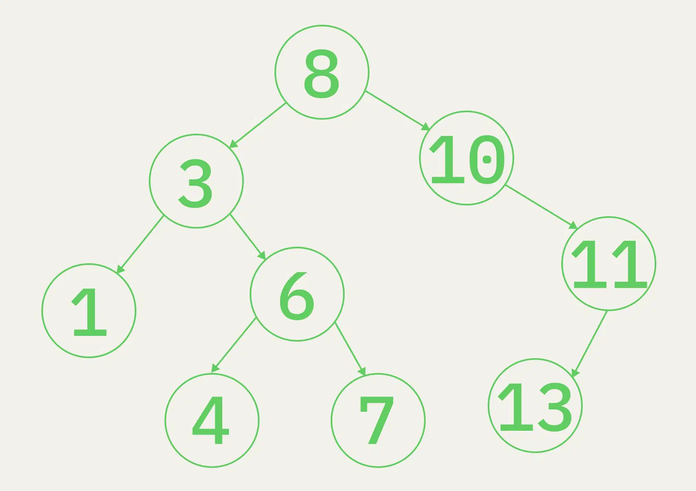

# Binary Search Tree (Двоичное дерево поиска, BST)

Иерархическая структура с упорядоченностью: для каждого узла левое поддерево содержит меньшие значения, правое —
большие.

## Правило вставки

- Значение меньше узла → влево; больше → вправо (рекурсивно вниз).

## Зачем

- Быстрый поиск и хранение в отсортированном виде с быстрыми вставкой/удалением.
- Search/insert/delete — O(log n) в среднем, но O(n) в вырожденном случае → нужны балансировки (см. ../avl.md,
  ../red-black.md).

## Links

- https://codechick.io/tutorials/dsa/dsa-binary-search-tree
