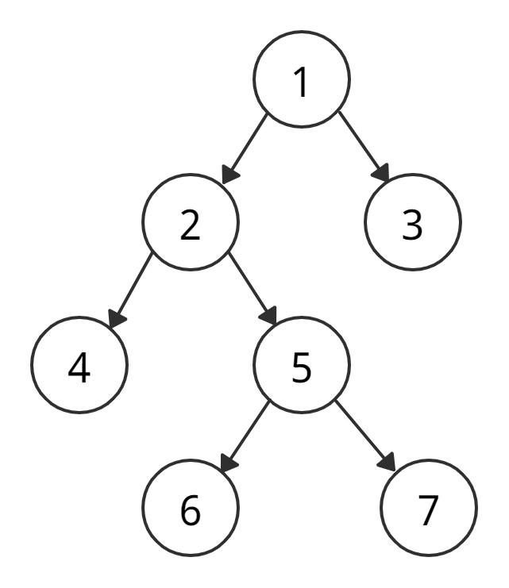
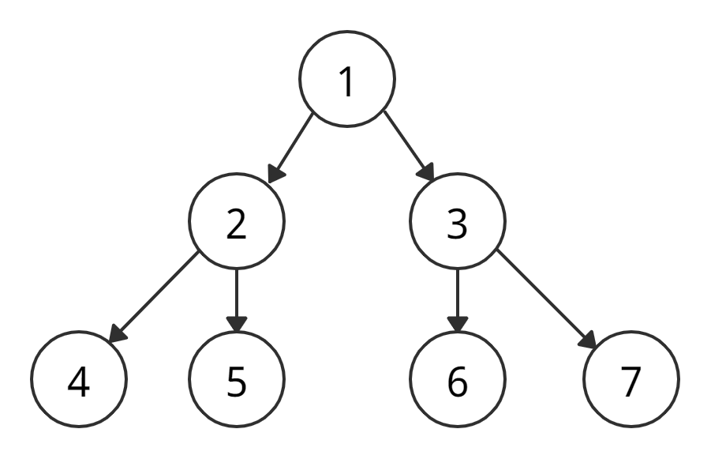
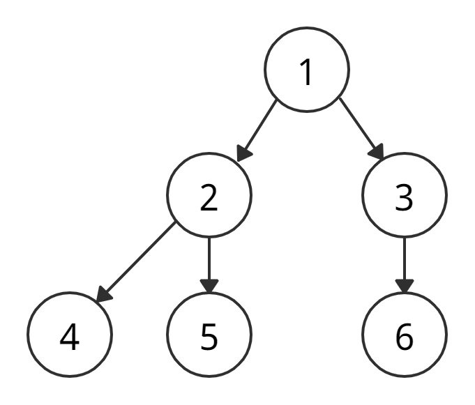
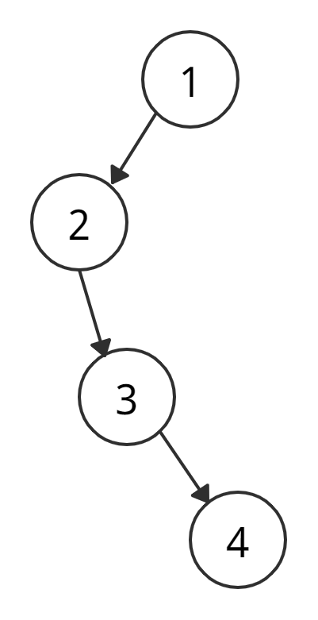
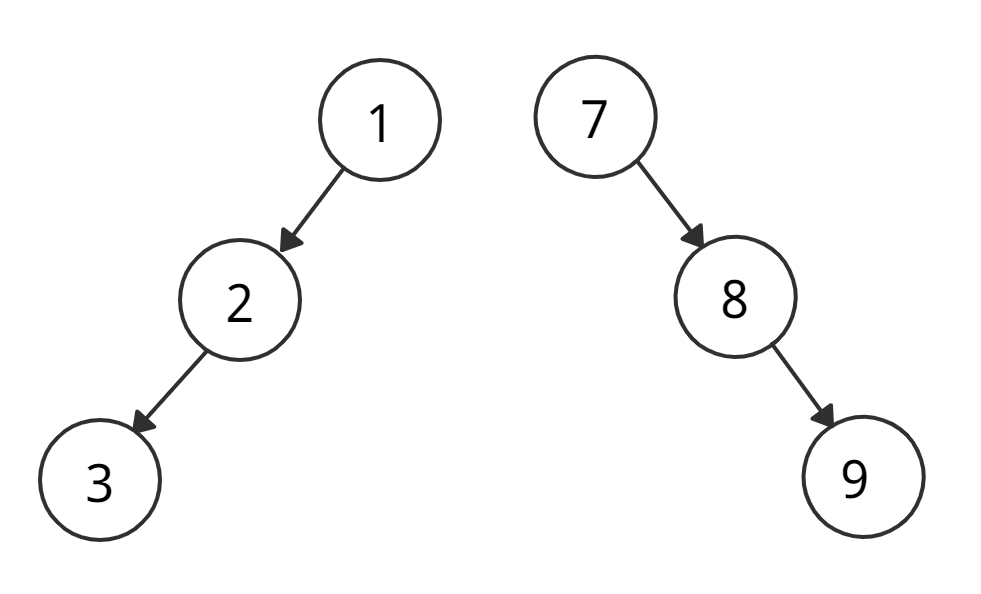
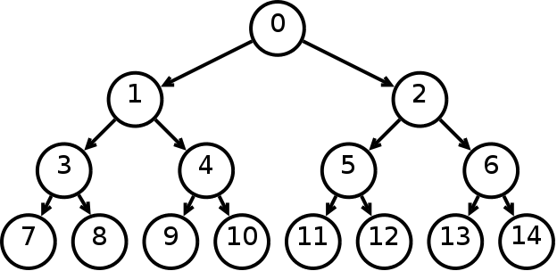

Binary Tree (Двоичное дерево)

Древовидная структура, в которой у узла не больше двух детей.

## Типы двоичных деревьев

### Полное (full)

У каждого узла либо 0, либо 2 потомка.

### Совершенное (perfect)

У каждого внутреннего узла по два ребёнка, а все листья на одном уровне.

### Законченное (complete)

Похоже на совершенное, но: все уровни заполнены, листья прижаты влево, у последнего листа может не быть правого соседа.
Поэтому законченное не обязательно полное.

### Вырожденное (degenerate)

На каждый уровень приходится по одной вершине (фактически список).

### Скошенное вырожденное (skewed)

Вырожденное только с левыми или только с правыми узлами — left-skewed и right-skewed.

### Сбалансированное (balanced)

Число вершин в левом и правом поддеревьях каждого узла различается на 0 или 1.

## Links

- https://codechick.io/tutorials/dsa/dsa-binary-tree
