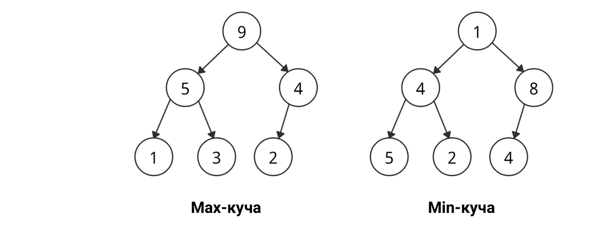

Heap (Куча)

Законченное двоичное дерево со свойством кучи: ключ родителя упорядочен относительно ключей детей.

## Виды

- **Max-heap** — каждый узел ≥ детей, в корне максимум.
- **Min-heap** — каждый узел ≤ детей, в корне минимум.

## Свойства

- Вставка и извлечение корня — O(log n), просмотр корня — O(1).
- Основа priority queue и heapsort; обычно хранится в массиве (см. ../../queue/priority-queue/index.md).

## Links

- https://codechick.io/tutorials/dsa/dsa-heap
