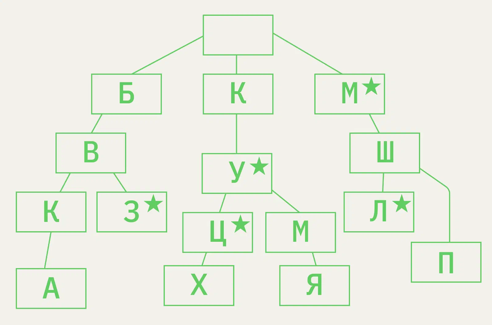

Trie (Префиксное дерево, бор)

Данные хранятся последовательно: каждый узел — символ/префикс, по которому находятся следующие узлы.

## Как применяют

- Данные, выдаваемые по цепочке: автозаполнение (по набранной букве дерево предлагает продолжения).
- Данные с повторяющимися префиксами: например, IP-адреса.
- Поиск/вставка за O(длина ключа), не зависит от числа ключей.

