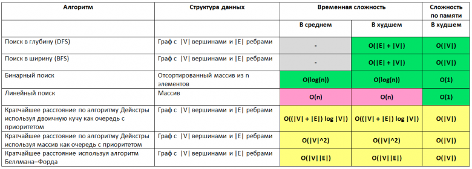

# Searching (Поиск)

Алгоритмы поиска элемента в коллекции. Выбор зависит от того, отсортированы ли данные и есть ли random access.

## Сравнение

## Алгоритмы

- **Linear** — O(n), работает на любых данных без подготовки.
- **Binary** — O(log n), требует отсортированный массив с random access.

## Links

- https://habr.com/ru/articles/188010/
