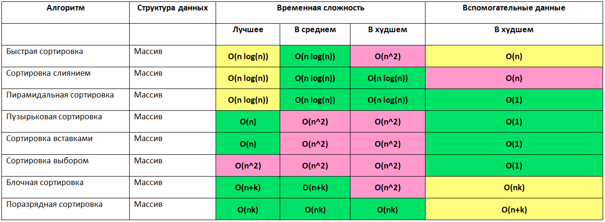

Sorting (Сортировка)

Алгоритмы упорядочивания. Ключевые свойства: сложность (best/avg/worst), стабильность, in-place, адаптивность.

## Сравнение

## Алгоритмы

- **O(n²)**: bubble, selection, insertion (плюс shell — O(n^1.5)).
- **O(n log n)**: merge (стабильна, не in-place), quick (in-place, средний случай).

## Links

- https://habr.com/ru/articles/188010/
